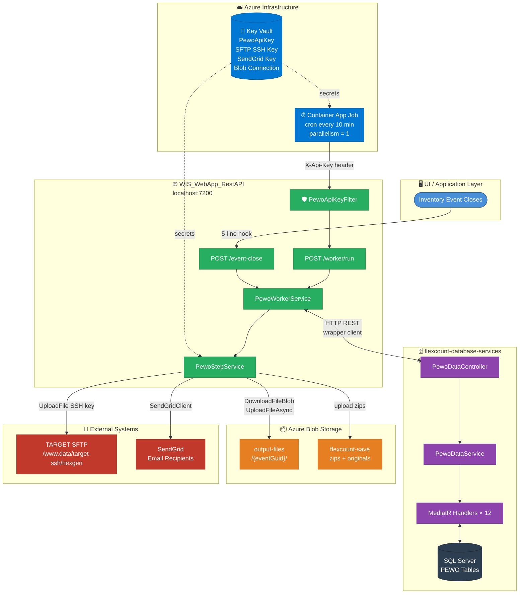
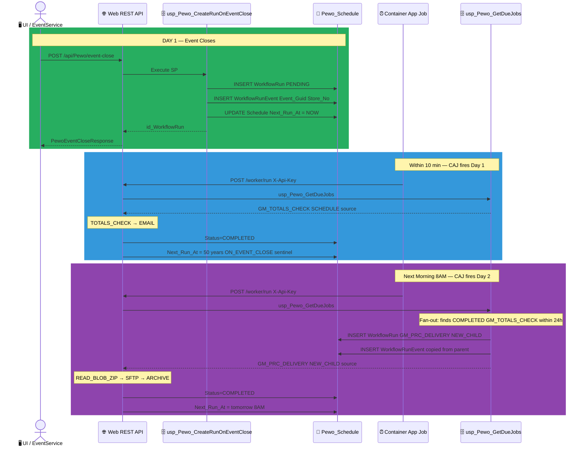
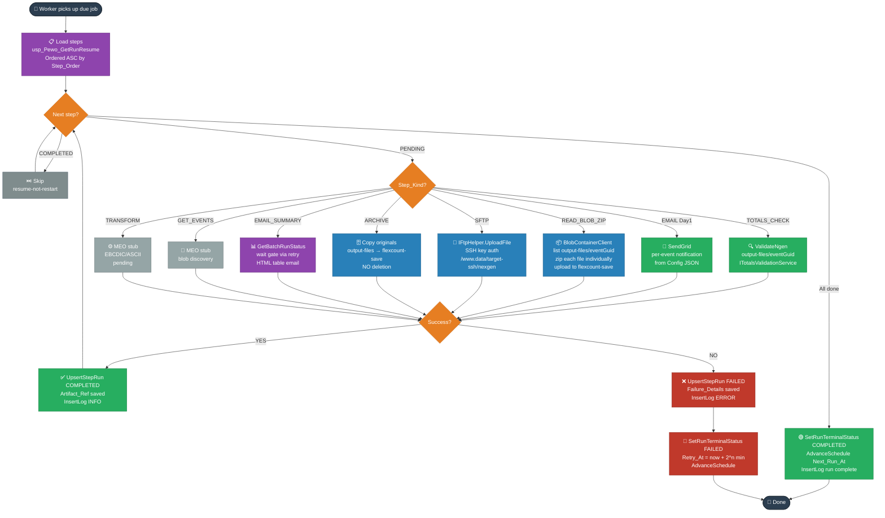
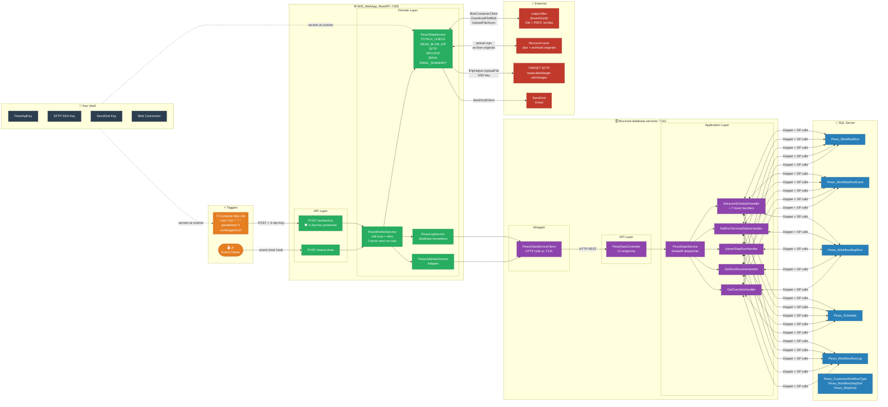

## Diagram 1 — High Level Components (Color Coded)

---

## Diagram 2 — Schedule Flow (Color Coded)

---

## Diagram 3 — Step Execution Flow (Color Coded)

---

## Diagram 4 — Email Communication Flow (Color Coded)

```mermaid
sequenceDiagram
    participant WS as 🌐 PewoWorkerService
    participant SS as ⚙️ PewoStepService
    participant DB as 🗄️ GetBatchRunStatus
    participant SG as 📧 SendGrid
    participant OPS as 📬 ops-team@company.com

    rect rgb(39, 174, 96)
        Note over WS,OPS: DAY 1 — Per-Event Notification
        WS->>SS: EmailAsync step_Kind=EMAIL
        SS->>SS: Build body RunId Store_No Event_Guid Completed UTC
        SS->>SG: SendEmailAsync recipients from Config JSON
        SG-->>OPS: TOTALS CHECK PASSED Store T1234
        SS-->>WS: artifact_ref = notified:2026-01-01T08:00:05Z
    end

    rect rgb(142, 68, 173)
        Note over WS,OPS: DAY 2 — Batch Summary Wait Gate
        WS->>SS: EmailSummaryAsync step_Kind=EMAIL_SUMMARY
        SS->>DB: GetBatchRunStatusAsync\nbatchKey=today\nbatchWorkflowTypeCode=GM_PRC_DELIVERY

        alt 🟡 Batch still active PENDING or RUNNING
            DB-->>SS: rows with Status=PENDING
            SS-->>WS: return FAIL — not yet terminal
            Note over WS: Retry backoff fires\n2^n minutes wait\nworker retries automatically
        else 🟢 All runs COMPLETED or FAILED
            DB-->>SS: all rows terminal
            SS->>SS: Build HTML table\nStore Event Date Status Detail
            SS->>SG: SendEmailAsync consolidated summary
            SG-->>OPS: GM + PRPC Delivery Summary\nHTML table all stores
            SS-->>WS: artifact_ref = summary-sent:2026-01-01:3events
        end
    end

    rect rgb(44, 62, 80)
        Note over SS: Idempotency Guards
        Note over SS: notified: prefix — skip if already sent
        Note over SS: summary-sent: prefix — skip if already sent
    end
```

---

## Diagram 5 — Consolidated Architecture (Color Coded)

