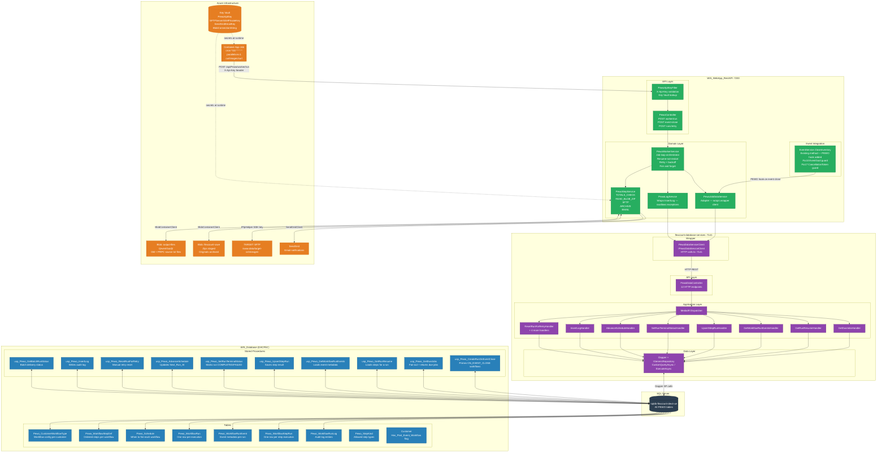
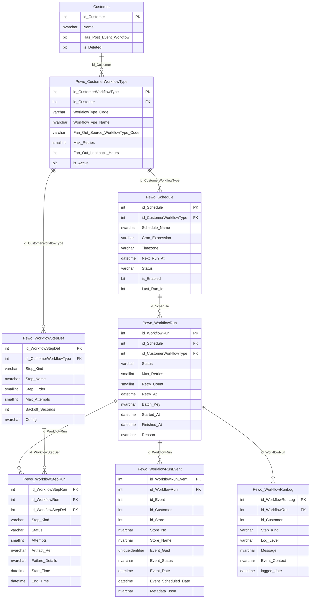
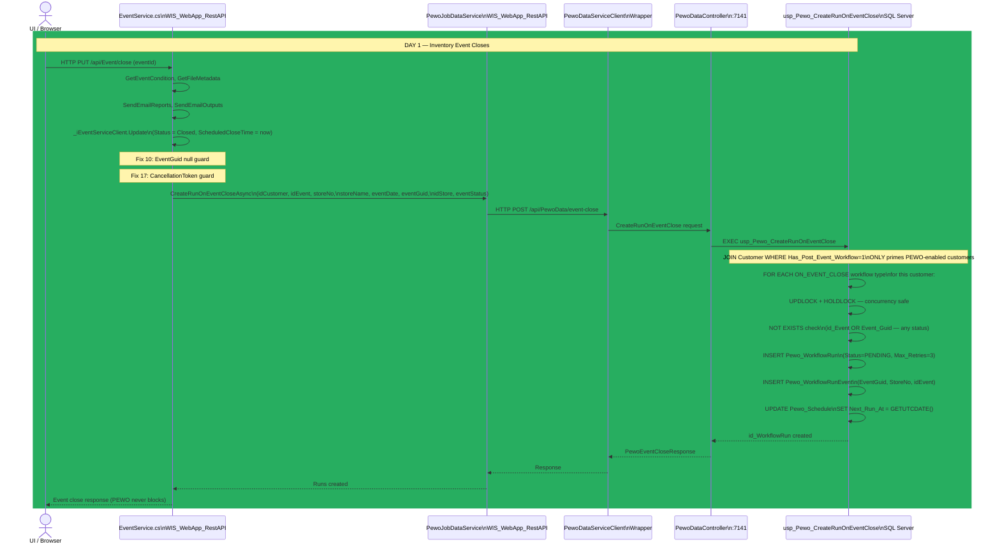
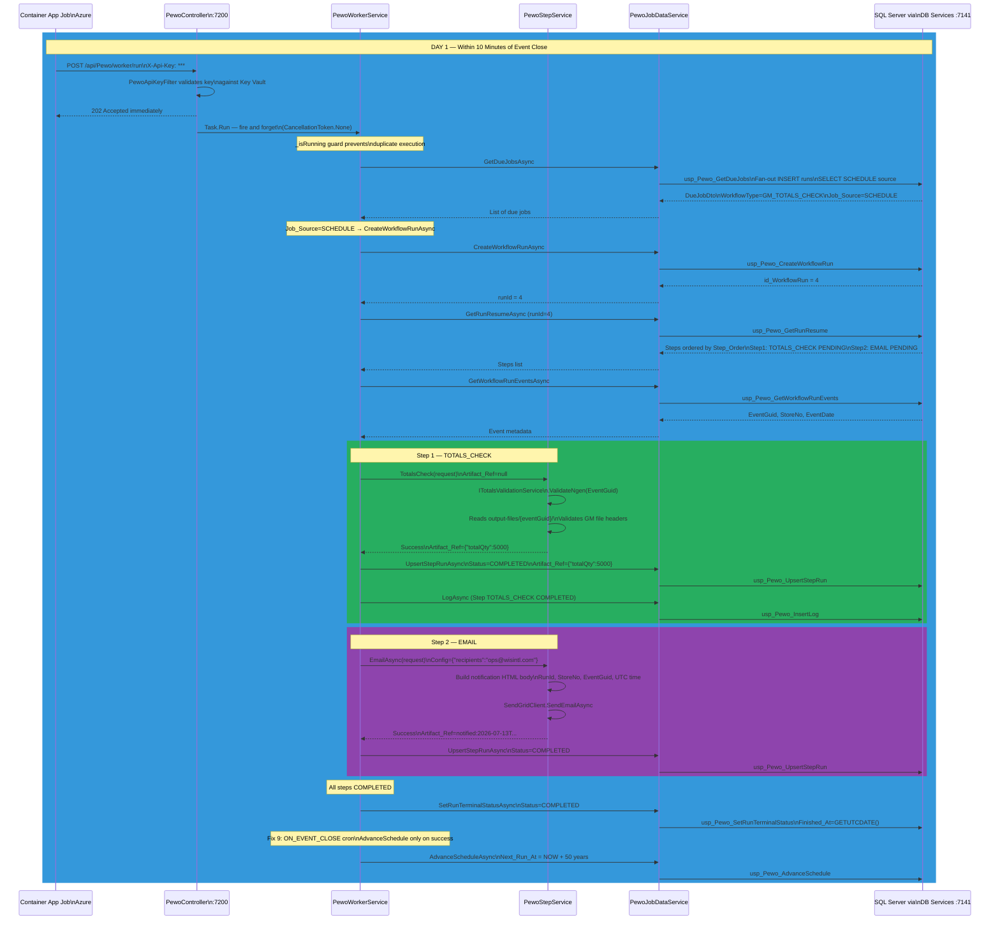
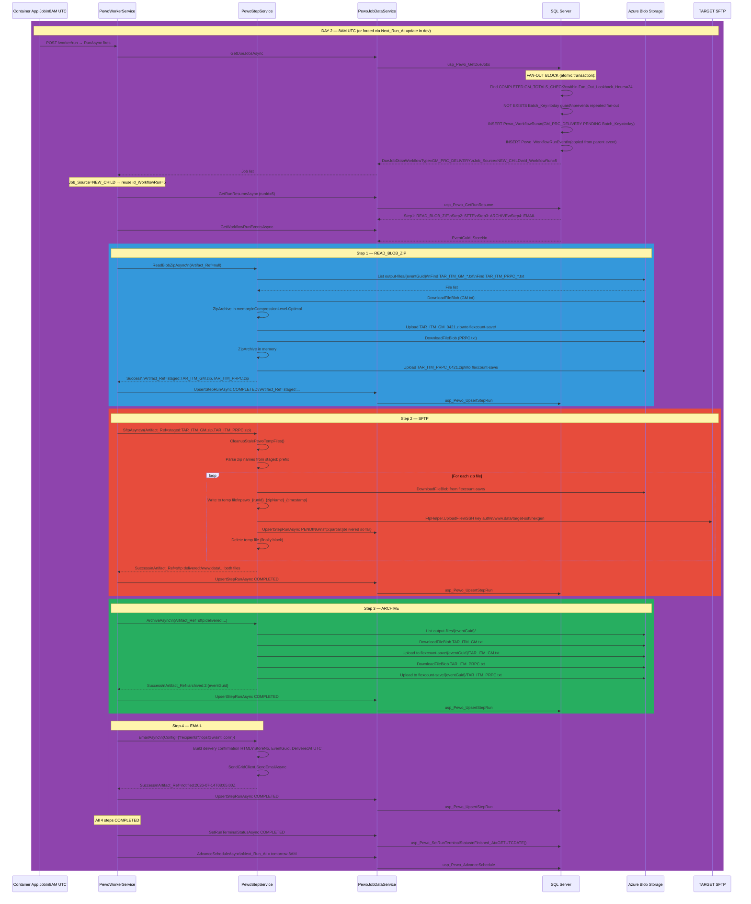
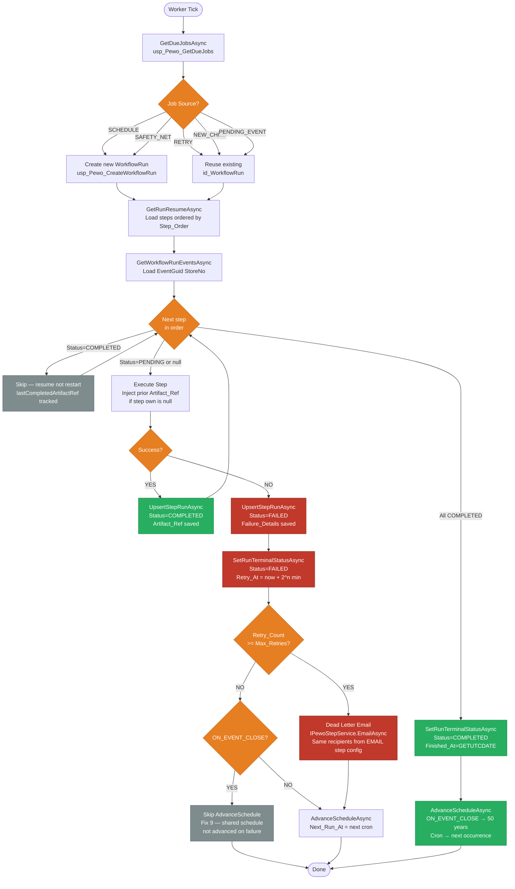

# PEWO — Post-Event Workflow Orchestrator
## Architecture, Code Flow & Behavior Documentation

---

## 1. Three-Repo Architecture Overview



---

## 2. Data Model — Entity Relationships



---

## 3. Day 1 — Event Close Sequence



---

## 4. Day 1 — Worker Processes Totals Check



---

## 5. Day 2 — Fan-Out and NGen Delivery



---

## 6. Retry Flow



---

## 7. Behavior Documentation

### What PEWO Does

PEWO (Post-Event Workflow Orchestrator) automates the NGen/PRPC file delivery process for the TARGET customer. It replaces manual SRE Unix scripts with a fully automated, resumable, auditable workflow system.

### Two Workflows

**GM_TOTALS_CHECK** (Day 1 — fires when event closes)
- Triggered: When inventory event closes via `EventService.CloseInventory`
- Steps: TOTALS_CHECK → EMAIL
- Purpose: Validate GM file headers and totals. Notify ops if passed.

**GM_PRC_DELIVERY** (Day 2 — fires at 8AM UTC)
- Triggered: Fan-out from completed GM_TOTALS_CHECK runs
- Steps: READ_BLOB_ZIP → SFTP → ARCHIVE → EMAIL
- Purpose: Zip source files, deliver to TARGET SFTP, archive originals, notify ops.

### Key Design Principles

**Resume-Not-Restart**
Every step writes its result to `Pewo_WorkflowStepRun` immediately after execution. On retry the worker loads all steps, sees which are already COMPLETED, and skips them. If SFTP of file 2 fails after file 1 succeeded — only file 2 is retried.

**Data-Driven Configuration**
Workflows, steps, schedules, recipients, container names, SFTP paths — all in seed data. No code changes needed to add a step, change a recipient, or onboard a new customer.

**Has_Post_Event_Workflow Guard**
`usp_Pewo_CreateRunOnEventClose` JOINs `Customer` table and only primes workflows for customers where `Has_Post_Event_Workflow = 1`. New customers are never accidentally enrolled.

**ON_EVENT_CLOSE Sentinel**
`GM_TOTALS_CHECK` schedule uses `Cron_Expression = 'ON_EVENT_CLOSE'` — not a real cron. `Next_Run_At` is set to NOW by the SP on event close, and reset to 50 years when the run completes. Worker knows not to advance the schedule on failure for event-driven workflows.

**Fan-Out**
`GM_PRC_DELIVERY.Fan_Out_Source_WorkflowType_Code = 'GM_TOTALS_CHECK'`. At 8AM `usp_Pewo_GetDueJobs` finds all COMPLETED GM_TOTALS_CHECK runs within 24 hours, creates one GM_PRC_DELIVERY child run per event atomically in a transaction. Each store is fully independent — one store failing does not block others.

**Simultaneous Event Closes**
Multiple stores closing at the same time each create their own `WorkflowRun` and `WorkflowRunEvent`. The PENDING_EVENT source in `usp_Pewo_GetDueJobs` catches any run orphaned because a sibling completed first and pushed the shared schedule to 50 years. Guard: `NOT EXISTS ON Pewo_WorkflowStepRun` prevents in-progress runs being picked up again.

**Fire and Forget**
`POST /api/Pewo/worker/run` returns 202 immediately. Worker runs in a background `Task.Run` with `CancellationToken.None` — not tied to HTTP request lifetime. `_isRunning` static guard prevents duplicate execution if CAJ fires again before previous tick completes.

**Logging Never Crashes the Worker**
`PewoLogService.LogAsync` wraps all DB calls in try/catch. A logging failure is written to the application log but never propagates to the worker. Steps and run status always complete correctly regardless of log failures.

**SFTP Partial Delivery**
After each zip is successfully delivered, progress is saved to `Pewo_WorkflowStepRun.Artifact_Ref` as `sftp:partial:{delivered files}`. On retry, already-delivered zips are skipped. No duplicate SFTP delivery.

**Dead Letter**
When a run exhausts all retries permanently, `PewoWorkerService` reads the EMAIL step's Config JSON, overrides the subject with a failure message, and calls `IPewoStepService.EmailAsync`. Same recipients as the normal completion email. No new configuration needed.

### Schedule States

| Workflow | Normal State | After Event Close | After Run Completes |
|---|---|---|---|
| GM_TOTALS_CHECK | Next_Run_At = 50 years | Next_Run_At = NOW | Next_Run_At = 50 years |
| GM_PRC_DELIVERY | Next_Run_At = tomorrow 8AM | Unchanged | Next_Run_At = next day 8AM |

### Artifact_Ref by Step

| Step | Artifact_Ref Value | Purpose |
|---|---|---|
| TOTALS_CHECK | `{"totalQty":5000,"totalExt":25000}` | Audit of validated totals |
| READ_BLOB_ZIP | `staged:file1.zip,file2.zip` | Tells SFTP which zips to deliver |
| SFTP | `sftp:delivered:/path:file1.zip,file2.zip` | Idempotency — skip if already delivered |
| ARCHIVE | `archived:2:{eventGuid}` | Confirms count of archived files |
| EMAIL | `notified:2026-07-13T08:05:00Z` | Idempotency — never send twice |

### Three Repos — What Each Owns

| Repo | Owns | Deployed Via |
|---|---|---|
| WIS_Database | Table schemas, SPs, indexes, constraints | DACPAC — declarative diff deployment |
| flexcount-database-services | HTTP API wrapping SP calls via Dapper | Container App |
| WIS_WebApp_RestAPI | Orchestration, step logic, blob, SFTP, email | Container App |

### Local Debug Order

```
1. Run seed scripts (once): StepKind → GM_TOTALS_CHECK → GM_PRC_DELIVERY
2. SSMS: EXEC usp_Pewo_CreateRunOnEventClose (simulate event close)
3. Postman: POST /api/Pewo/worker/run (Day 1 — totals check + email)
4. SSMS: UPDATE Pewo_Schedule SET Next_Run_At = DATEADD(MINUTE,-1,GETUTCDATE())
         WHERE WorkflowType_Code = 'GM_PRC_DELIVERY'
5. Postman: POST /api/Pewo/worker/run (Day 2 — delivery)
6. Verify: SELECT * FROM Pewo_WorkflowRun / Pewo_WorkflowStepRun / Pewo_WorkflowRunLog
7. Cleanup: Delete runs cascade, reset schedules, repeat from step 2
```
