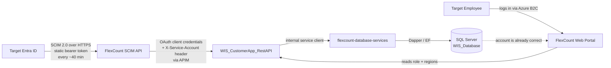
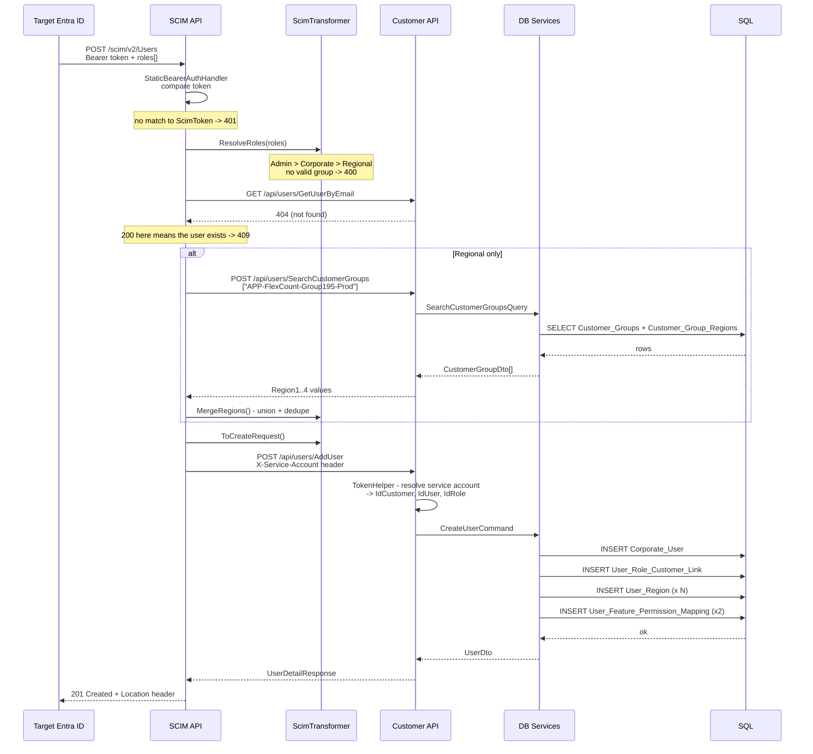
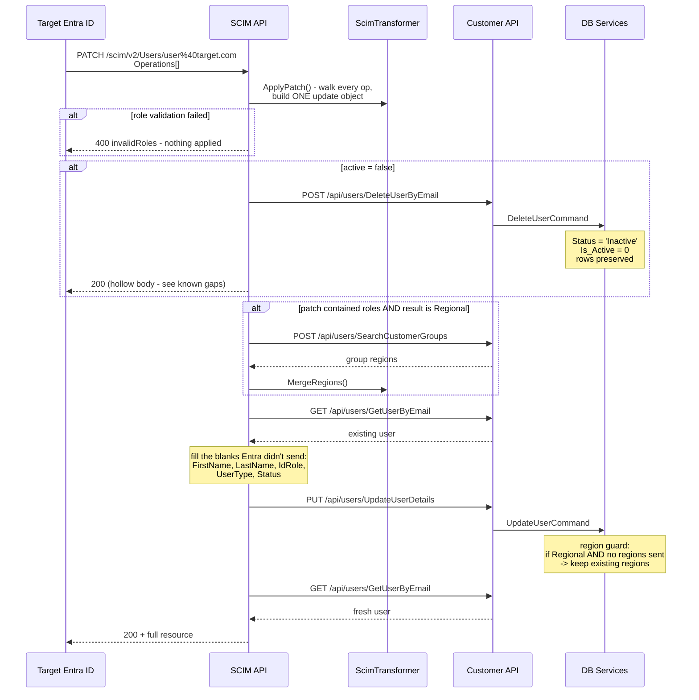
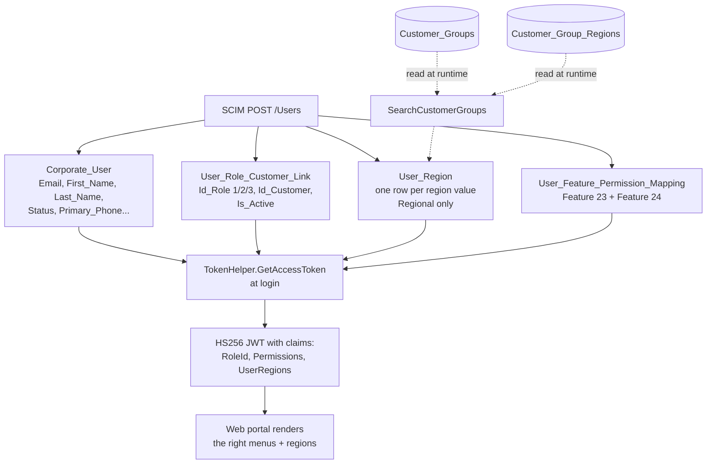
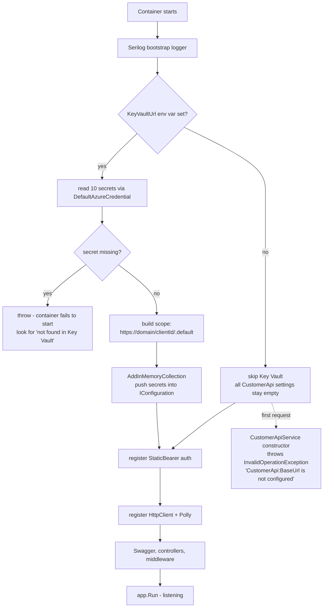

# Architecture

Diagrams, each with an explanation next to it.

**A note on the syntax:** Azure DevOps renders Mermaid, but it's pinned to an old version with limited syntax support. That means `graph` (not `flowchart`), no icons, no `architecture-beta`. Everything here sticks to what actually renders. The infrastructure diagram uses draw.io instead, because that's the one where Azure icons genuinely help.

---

## 1. System context — who talks to whom

The 30-second picture. If you only look at one diagram, look at this one.



**Reading it:** the top line is the provisioning path — it runs on a timer, nobody's watching. The bottom line is the login path — it runs when a human shows up. They never touch each other. They meet in the database.

The important thing to understand: **by the time a Target employee clicks "Log in", their role and regions were already written by a job that ran up to 40 minutes ago.** If their access looks wrong, the problem is almost never in the login path.

---

## 2. Azure infrastructure

The runtime picture — what's actually deployed.

> **Source file:** [`diagrams/scim-azure-infrastructure.drawio`](./diagrams/scim-azure-infrastructure.drawio)
> Open it at [app.diagrams.net](https://app.diagrams.net) (or the VS Code draw.io extension), edit, then export a PNG next to it as `scim-azure-infrastructure.png`.
> The `.drawio` file is the source of truth. The PNG is just for people reading the wiki.

What's in it:

| Component | What it is | Notes |
|---|---|---|
| **Azure Container Apps** | Where this API runs | .NET 8 container, built from the repo `Dockerfile` |
| **Azure Key Vault** | All secrets | Read at startup via `DefaultAzureCredential`. Vault URL comes from the `KeyVaultUrl` env var, injected by SRE |
| **Microsoft Entra ID** (`login.microsoftonline.com`) | Issues our outbound OAuth token | We call `/oauth2/v2.0/token` with client credentials |
| **Azure API Management** | Front door for the Customer API | `CustomerApiBaseUrl` points here |
| **AKS** | Where the Customer API runs | Behind an Application Gateway ingress at `/customerapprestapi/*` |
| **Azure SQL** | `WIS_Database` | Only `flexcount-database-services` talks to it |
| **Datadog** | Logs and traces | The container image wraps the app in `datadog-init` |

**Deployment:** `azure-pipeline-ci.yml` builds, `azure-pipeline-cd.yml` releases. Both are thin — the real work is in templates from the `DevOpsPipelineTemplates` repo, on the `release` branch. If you need to change how this deploys, that's where you go, not here.

---

## 3. Create a user — `POST /scim/v2/Users`

The fullest path. Everything else is a subset of this.



**Things worth noticing:**

- The duplicate check is a real HTTP call. Every create costs two round trips minimum.
- Admin and Corporate skip the whole `SearchCustomerGroups` block. No region lookup at all.
- Multiple groups = **one** call, not one per group. `SearchCustomerGroups` takes an array.
- The two `User_Feature_Permission_Mapping` rows are always written — Feature 23 and Feature 24, enabled or disabled based on the role.

---

## 4. Change a role — `PATCH /scim/v2/Users/{id}`

The one with the most branches.



**The region guard is the important bit.** In `UpdateUserCommandHandler`:

```csharp
bool becomingRegional  = updateUserCommand.UserRoleCustomerLink?.IdRole == 3;
bool hasIncomingRegions = updateUserCommand.Regions != null && updateUserCommand.Regions.Any();

if (updateUserCommand.Regions != null)
    if (!becomingRegional || hasIncomingRegions)
        existingUser.AddOrUpdateUserRegions([...]);
```

`AddOrUpdateUserRegions` is **wipe-and-replace** — anything not in the incoming list gets deleted. So the guard matters:

| Role after the patch | Regions sent? | What happens |
|---|---|---|
| Regional | yes | replace with the new set |
| Regional | **no** | **skip — keep what they had** |
| Admin / Corporate | no | wipe (correct — they shouldn't have any) |
| Admin / Corporate | yes | replace (shouldn't happen) |

That second row is why a name-only change doesn't destroy a Regional user's market access. If you ever touch this handler, that's the line to be careful with.

---

## 5. How a role is decided

The single most important piece of logic in the repo. `ScimTransformer.ResolveRoles()`.

```mermaid
graph TD
    A[roles array from Entra] --> B{empty or null?}
    B -->|yes| Z[throw ArgumentException<br/>400 to Entra]
    B -->|no| C[for each role]

    C --> D{value starts with '{' ?}
    D -->|yes| E[parse JSON,<br/>take inner 'value']
    D -->|no| F[use value as-is]
    E --> G
    F --> G{starts with<br/>APP-FlexCount- ?}

    G -->|no| H[skip this one]
    G -->|yes| I{which pattern?}

    I -->|Corporate-User-HQ-| J[hasAdmin = true]
    I -->|Corporate-User-| K[hasCorporate = true]
    I -->|Group + digits| L[add to groupNames]

    H --> M{more roles?}
    J --> M
    K --> M
    L --> M
    M -->|yes| C
    M -->|no| N{hasAdmin?}

    N -->|yes| O[Admin - no groups]
    N -->|no| P{hasCorporate?}
    P -->|yes| Q[Corporate - no groups]
    P -->|no| R{any groups?}
    R -->|yes| S[Regional + groupNames]
    R -->|no| Z
```

**Read the order.** `Corporate-User-HQ-` is checked **before** `Corporate-User-`, because the second is a prefix of the first. Swap them and every Admin becomes a Corporate user with no error anywhere.

Also note: `primary` is never looked at. Every role in the array is considered. That's intentional — Entra doesn't reliably set `primary` on multi-group users.

---

## 6. Where the data lands

What a create actually writes.



**The join between the two halves.** SCIM writes `Id_Role` and `User_Region` rows. Hours later, at login, `TokenHelper.GetAccessToken` reads those same rows back and packs them into the token the web app decodes. That's how an Entra group assignment ends up deciding which buttons a person can see.

`Customer_Groups` and `Customer_Group_Regions` are **read-only** from SCIM's point of view. We never write them. They're seeded by `PS_SSO_Config.sql`.

---

## 7. Startup

What happens when the container boots. Useful when it doesn't.



**The failure mode to know:** if `KeyVaultUrl` is empty, the app **starts fine** and then fails on the first request with a config error. It looks like a runtime bug. It's a missing environment variable. See [03-configuration.md](./03-configuration.md).

---

## 8. Which layer owns what

| Question | Answered by |
|---|---|
| Is this caller allowed in? | `StaticBearerAuthHandler` (SCIM API) |
| Which FlexCount role does this Entra group mean? | `ScimTransformer.ResolveRoles` (SCIM API) |
| Which regions does Group195 have? | `Customer_Groups` / `Customer_Group_Regions` (database) |
| Which customer are we writing to? | `TokenHelper` (Customer API), from the service account row |
| Should these regions be replaced or kept? | `UpdateUserCommandHandler` (DB services) |
| What can this user see in the portal? | `TokenHelper.GetAccessToken` claims (Customer API), at login |

If you're about to add logic, check this table first. Most "where should this go?" questions answer themselves once you know region values live in the database and role mapping lives in code.
